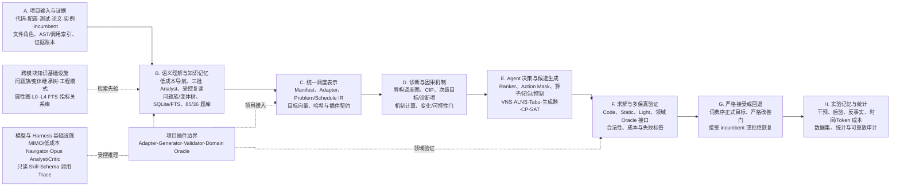
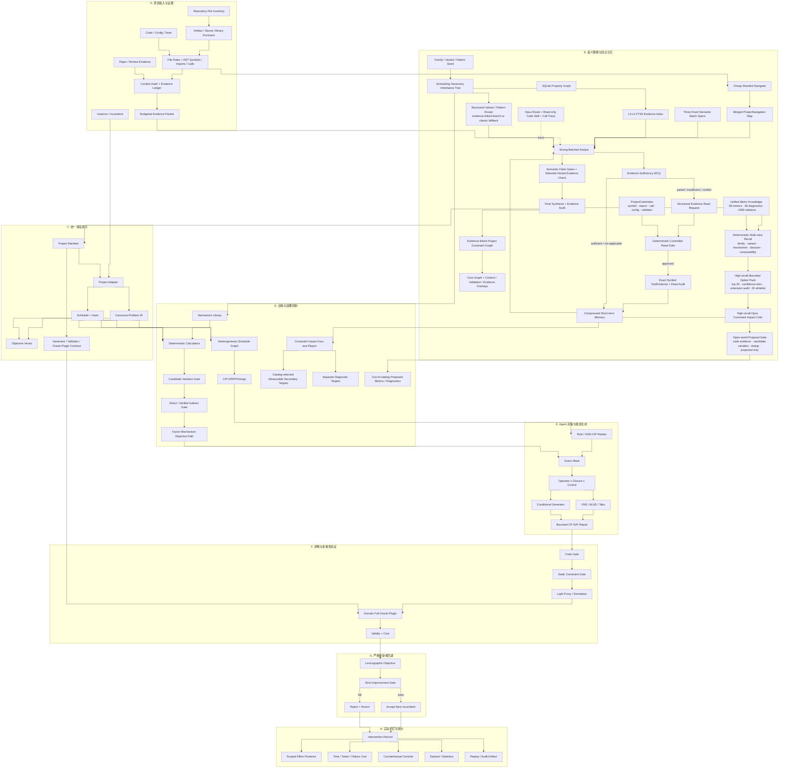
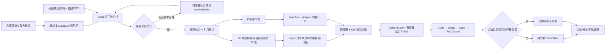
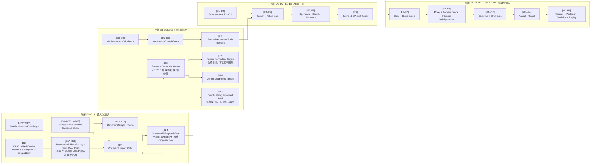

# Causal Schedule Lab 三层项目图

> 文档性质：项目扩展的结构地图  
> 当前版本：`0.7.4`  
> 最近核验：2026-07-26  
> 维护规则：新增模块、改变数据流或改变状态时，本图与
> [项目状态与路线图](PROJECT_STATUS_AND_ROADMAP.md)必须同步更新。

需要放大、拖拽或全屏查看时，打开
[可缩放交互版本](PROJECT_MODULE_GRAPH_INTERACTIVE.html)。

本 Markdown 只维护可审阅的 Mermaid 结构，不嵌入 PNG 快照。项目模块、实现状态、
数据流、文件映射或里程碑变化时，必须在同一次修改中同步更新：

1. 本文件的第一层大模块图；
2. 本文件的第二层实现细节图；
3. 本文件的第三层真实组件映射；
4. `PROJECT_MODULE_GRAPH_INTERACTIVE.html`；
5. README 和文档索引中的可视化入口；
6. 项目内其他引用相同架构、状态或流程的图形。

任何导出的截图、SVG、PNG、演示图或外部展示图，只要仍作为当前项目图使用，也必须
随对应模块变化重新生成；无法同步的旧图应明确标记为历史版本或移除，不能继续冒充
当前架构。

文档可同时从主模块和 `docs/intersections/` 的交叉索引检索；测试资产统一登记在
`tests/test_registry.json`，以模块与能力 Marker 复用。这两项属于治理视图，不改变
下方运行时节点和数据流。

## 第一层：大模块图

大模块职责：

| 大模块 | 核心输入 | 核心输出 | 当前状态 |
|---|---|---|---|
| A. 项目输入与证据 | 代码、论文、配置、测试、实例、incumbent | 文件角色清单、AST/导入/调用索引、哈希证据账本与 evidence packet | 主闭环已运行 |
| B. 语义理解与知识记忆 | 仓库导航、项目证据、问题族/变体知识和指标先验 | Project Semantics、复读审计、约束图、分层证据、Token 有界候选包 | 单轮链和确定性召回已运行；分阶段链已在线跑通但尚未成为默认 runtime |
| C. 统一调度表示 | manifest、adapter、incumbent、插件配置 | `Problem`、`Schedule`、目标向量、哈希和插件契约 | 主闭环已运行 |
| D. 诊断与因果机制 | IR、项目语义、知识、incumbent | 调度图、CIP、目录约束次级目标、诊断项、机制测量和资格门 | CIP 与可选 Critic 已运行；完整因素识别未实现 |
| E. Agent 决策与候选生成 | CIP、后验、预算、语义 Mask | 算子/闭包/控制动作与局部候选 | CP-SAT 主链已运行；学习式排序和组合搜索未默认接入 |
| F. 求解与多保真验证 | 局部候选、硬约束、代理和领域 Oracle | Code/Static/Light/Full 合法性、成本与失败标签 | 通用主闭环已运行；具体项目 Full Oracle 由插件提供 |
| G. 严格接受或回退 | 正式目标差值和完整验证结果 | 新 incumbent、拒绝/恢复记录 | 主闭环已运行 |
| H. 实验记忆与统计 | 干预、结果、失败、时间和 Token | 作用域效应后验、反事实、报告和训练数据 | 基础代码已实现但未接入默认控制器 |

三层图只描述当前仓库中已经存在的组件和真实数据流。尚未实现的能力只写入
`PROJECT_STATUS_AND_ROADMAP.md`；第三层每个节点必须在标题中标明其第二层父节点 ID。

**当前阶段边界（2026-07-26）**：A/B 的第一阶段语义、次级目标与开放提案入口已经
暂时封板；下一阶段的工程主线落在 D/E/F/H，即从甘特图定位 Factor/Interaction，选择
合法算子与闭包，调用项目求解器生成候选，并以 Oracle 和配对实验验收。图中这些接口
已存在不代表 Agentic RL、GNN 或条件生成模型已经训练。

## 第二层：大模块内部实现图

## 当前已经完成的端到端流程

项目现在有两条相连但职责不同的可执行链。第一条回答“陌生调度项目究竟实现了什么”，
第二条回答“在已确认语义和稳定 incumbent 上怎样提出并验证改进”。

其中第一条分阶段语义链已在真实 FJSP 仓库在线跑通，但仍是显式 CLI，不是所有项目
默认自动执行；第二条通用优化链的 CP-SAT 与多级验证已经运行，具体项目的 Full Oracle
仍必须由对应插件提供。`D8` 目前只是次级目标选择，真正的影响因素还需后续受控干预、
Oracle 回放和统计验证，不能在这里提前宣称完成。

## 第三层：第二层组件的真实实现展开

第三层不展示未来路线，只展开第二层已经存在的代码、数据和运行组件。节点标题中的
方括号就是它对应的第二层 ID。确定性目录召回和有界选择包已经进入当前实现；尚未
实现的完整递归 Factor Discovery 不进入本图，只保留在路线图中。

当前指标路径为 `[B16] → [B17–B18] → [B9] → [D8/D10]`，并从 `[B9] → [B24] → [D12]`
提供开放世界旁路：程序先按问题族、
变体、机制和可修改决策召回，再标记缺失 IR 字段并压缩到最多 20 个候选；LLM 只能
返回候选包中的 ID，并以三档置信度保留高召回候选。诊断项大库已由 B16 加载，但当前 D10 仍使用固定诊断枚举，尚未
接入同样的动态选择链。题库外提案必须绑定代码证据；新次级目标还必须说明同实例
候选变化和可干预决策，只进入 proposed 池。真正的因素发现目前只有 `[D3–D7]` 的机制、变化、可控性和
路径接口；完整递归发现仍属于路线图，不冒充当前项目结构。

## 代码阅读 Agent 引导库当前包含什么

这部分由程序 Harness 和只读 Skill 共同组成，不是把整个仓库一次性塞给模型。

| 层 | 已实现内容 | 作用 |
|---|---|---|
| 仓库清单 | 文件角色、大小、SHA-256、顶层 symbol、import、摘要；过滤论文、密钥、权重、日志、结果和二进制 | 先知道“有哪些东西”，避免盲读 |
| 低成本导航 | 分片读取后合并 `ProjectNavigation`：模块、入口、配置、训练、评估、Validator/Oracle、优先路径和未知项 | 给强模型一张代码地图 |
| 三批任务 | 环境/数据；目标/硬约束/实现路径；决策/Oracle/未知项 | 减少一次长 Prompt 混杂多个问题 |
| 固定选择题 | 证据充分度、项目角色、约束/决策/目标类别、可信度、是否需要复读 | 稳定输出并让程序可以机械判定 |
| 结构化复读请求 | 路径、symbol、原因、期望证据、优先级、关联事实 | 模型只能申请，不能任意浏览 |
| 程序读门 | 校验根目录、重复读、secret/paper、symbol 是否存在，以及 call/import/config/validator 关联；执行轮次和总预算 | 防止循环读、幻觉路径和 Token 失控 |
| 精确证据工具 | 读取目标 symbol 的准确行区间，并最多跟随 3 个同文件 callee；产生独立 evidence ID 和哈希 | 补足跨函数隐性约束 |
| 短期记忆 | 已确认事实、矛盾、未决项、批次摘要、证据 ID | 后续批次保留压缩上下文 |
| 长期记忆 | SQLite 属性图、L0–L4 FTS、问题族/单一变体 Head、工程模式和冲突记录 | 只注入命中的祖先链与分支，不展开整库 |
| Claim Gates | evidence、reachability、applicability、control、objective relevance、Oracle coverage | 防止把死代码、训练技巧或论文描述当成项目约束 |
| 最终综合 | 完整 evidence packet、Schema 校验/修复、引用路径和 symbol 审计、约束语义图、调用 Trace | 输出可回放、可定位的项目语义 |
| Claude Code 只读 Skill | `Glob/Grep/Read` 边界、导航优先、focused trace、correction ledger、bounded reread 和 review checklist | 约束模型怎样看代码；Harness 模式下读权限仍归程序 |

当前库刻意不允许模型执行 Bash、修改文件、联网、读取 `.env`、权重或结果目录。代码
事实以可达执行路径为准；论文和知识库只作先验，不能覆盖项目代码证据。

## 当前真实代码映射

| 图中节点 | 当前文件 |
|---|---|
| A0–A7、B0–B5、B19–B23 | `semantic_agent.py`、`llm_semantics.py`、`semantic_compiler.py`、`semantics.py` |
| B6 | `storage/graph_store.py` |
| B7 | `storage/memory.py` |
| B8、B12、B15 | `semantic_knowledge.py`、`taxonomy.py`、`knowledge/scheduling_families.json`、`knowledge/variant_heads.json`、`storage/memory.py` |
| B9 | `constraint_impact.py` |
| B10 | `providers/claude_code_cli.py`、`providers/tracing.py`、`.claude/skills/scheduling-code-semantics/` |
| B11 | `.claude/skills/scheduling-code-semantics/`、`docs/modules/module_b_semantics_memory/EXTERNAL_SKILL_PATTERN_REVIEW.md` |
| B13 | `semantic_graph_models.py`、`semantic_graph.py`、`llm_semantics.py` |
| B14 | `semantic_graph_models.py`、`semantic_graph.py` |
| B16 | `secondary_metric_knowledge.py`、`knowledge/secondary_metrics/round3/` 至 `round6/`、`compatibility/` |
| B17–B18 | `secondary_metric_knowledge.py`、`constraint_impact.py` |
| B24、D12 | `constraint_impact.py` 的 open-world metric/diagnostic proposals、证据/去重/候选变化门 |
| C1–C6 | `project.py`、`plugins.py`、`ir.py`、`objective.py` |
| D1 | `graph.py` |
| D2 | `cip.py`、`models.py` |
| D3–D7 | `mechanisms.py`、`knowledge/mechanism_targets.json` |
| D8–D10 | `constraint_impact.py`、`semantic_graph.py` |
| E1–E6 | `learning.py`、`agent.py`、`agentic_rl.py`、`operators.py`、`search.py`、`repair.py`、`conditional_generator.py`、`solvers/cp_sat.py` |
| F1–F5 | `core_validation.py`、`validation.py`、领域 Oracle 插件接口 |
| G1–G4 | `objective.py`、`controller.py` |
| H1–H3 | `storage/graph_store.py`、`mechanisms.py`、`posterior.py` |
| H4–H6 | `counterfactuals.py`、`dataset.py`、`experiment_runner.py`、`statistics.py`、`audit.py` |

第三层父子映射：

| 第三层节点 | 当前实现与状态 |
|---|---|
| B.impl.1 → B0–B5/B19–B23 | `semantic_agent.py`、`llm_semantics.py`、`semantic_compiler.py`、`semantics.py` |
| B.impl.2 → B13–B14 | `semantic_graph.py`、`semantic_graph_models.py` |
| B.impl.3 → B8/B12/B15 | `semantic_knowledge.py`、`taxonomy.py`、问题族与变体知识文件 |
| B.impl.4 → B9 | `constraint_impact.py` |
| B.impl.5 → B16 | 85 个指标、36 个诊断、1056 条去重关系和原 11 项兼容绑定 |
| B.impl.6 → B17–B18 | 确定性多视图召回、缺字段标记、最多 20 项高召回包、置信分层、扩展字段审计和返回 ID 白名单 |
| B.impl.7 → B24 | 题库外代码证据提案、候选变化字段、精确去重、拒绝原因与 proposed 状态 |
| D.impl.1–2/6 → D8–D10 | `constraint_impact.py` 的四轴影响、目录约束次级目标与固定诊断枚举 |
| D.impl.7 → D12 | 题库外新次级目标与新诊断项的待审核候选池 |
| D.impl.3–5 → D3–D7 | `mechanisms.py`、`knowledge/mechanism_targets.json` |
| E.impl.1–4 → D1/D2/E1–E6 | `graph.py`、`cip.py`、`learning.py`、`agent.py`、`search.py`、`repair.py` |
| V.impl.1–5 → F/G/H | `core_validation.py`、`validation.py`、`objective.py`、`controller.py`、`posterior.py`、`statistics.py` |

## 扩展规则

以后增加能力时，应先决定它属于哪个大模块，再增加第二层节点；涉及次级目标、因素、
干预或因果验证时，还必须同步第三层节点：

1. 新知识或综述进入 B，不直接进入优化器；
2. 新调度问题先扩展 C 的 IR/adapter，再扩展 D 的机制；
3. 新算子只进入 E，不能绕开 F；
4. 新 Oracle 只改变 F 的验证能力，不直接宣布候选更优；
5. 新实验结果进入 H，通过后验影响 D/E，不能覆盖原始证据；
6. 任何新路径都必须最终回到 G 的严格改善门。

文档必须跟随相同模块编号归档到 `docs/modules/module_a_*` 至
`docs/modules/module_h_*`；跨模块总览进入 `docs/cross_module/`。专题文档标题后必须
标注主模块，不能继续按“architecture/semantics/guides”等内容类型横向堆放。
