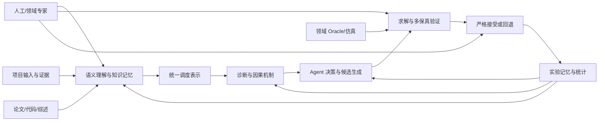
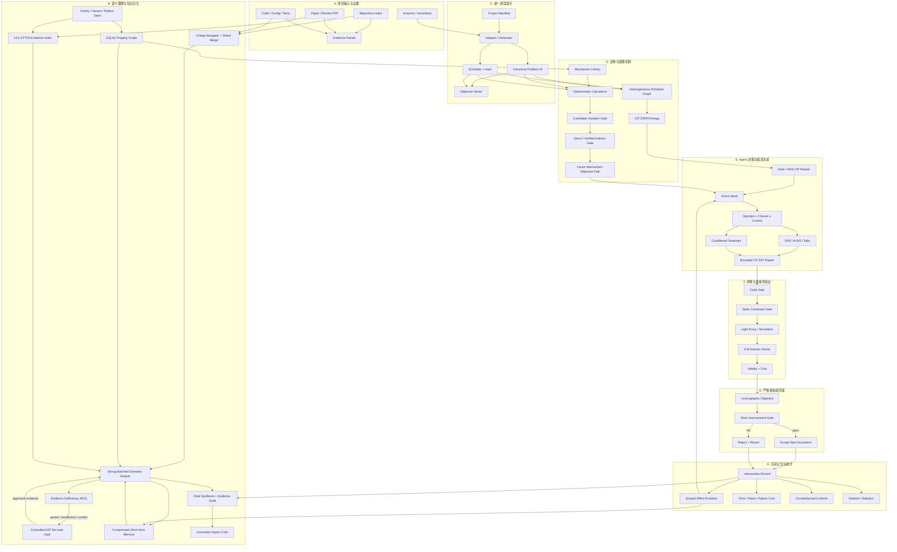

# Causal Schedule Lab 两层项目图

> 文档性质：项目扩展的结构地图  
> 当前版本：`0.5.0`  
> 最近核验：2026-07-25  
> 维护规则：新增模块、改变数据流或改变状态时，本图与
> [项目状态与路线图](PROJECT_STATUS_AND_ROADMAP.md)必须同步更新。

需要放大、拖拽或全屏查看时，打开
[可缩放交互版本](PROJECT_MODULE_GRAPH_INTERACTIVE.html)。

本 Markdown 只维护可审阅的 Mermaid 结构，不嵌入 PNG 快照。项目模块、实现状态、
数据流、文件映射或里程碑变化时，必须在同一次修改中同步更新：

1. 本文件的第一层大模块图；
2. 本文件的第二层实现细节图；
3. `PROJECT_MODULE_GRAPH_INTERACTIVE.html`；
4. README 和文档索引中的可视化入口；
5. 项目内其他引用相同架构、状态或流程的图形。

任何导出的截图、SVG、PNG、演示图或外部展示图，只要仍作为当前项目图使用，也必须
随对应模块变化重新生成；无法同步的旧图应明确标记为历史版本或移除，不能继续冒充
当前架构。

## 第一层：大模块图

大模块职责：

| 大模块 | 核心输入 | 核心输出 | 当前状态 |
|---|---|---|---|
| A. 项目输入与证据 | 代码、论文、配置、测试、实例 | 可引用 evidence packet | 主闭环已运行 |
| B. 语义理解与知识记忆 | 仓库导航、项目证据、问题族先验 | Project Semantics、读请求审计、图谱节点、分层证据 | 单轮语义主链已运行；分阶段链和长期记忆代码已实现但未进入默认 runtime |
| C. 统一调度表示 | 项目 adapter、incumbent | `Problem`、`Schedule`、目标向量 | 主闭环已运行 |
| D. 诊断与因果机制 | IR、知识、incumbent | CIP、机制测量、资格门 | CIP 主链已运行；机制代码已实现但未接入 |
| E. Agent 决策与候选生成 | CIP、后验、预算 | 算子、闭包、局部候选 | 部分主链已运行 |
| F. 求解与多保真验证 | 局部候选、硬约束、Oracle | Code/Static/Light/Full 结果 | 主闭环已运行 |
| G. 严格接受或回退 | 目标差值、Full 结果 | 新 incumbent 或拒绝记录 | 主闭环已运行 |
| H. 实验记忆与统计 | 干预、结果、成本 | 效应后验、报告、训练数据 | 基础代码已实现但未接入 |

## 第二层：大模块内部实现图

## 当前真实代码映射

| 图中节点 | 当前文件 |
|---|---|
| B0–B5 | `semantic_agent.py`、`llm_semantics.py`、`semantic_compiler.py`、`semantics.py` |
| B6 | `storage/graph_store.py` |
| B7 | `storage/memory.py` |
| B8 | `semantic_knowledge.py`、`knowledge/scheduling_families.json` |
| B9 | `constraint_impact.py` |
| C1–C5 | `project.py`、`plugins.py`、`ir.py`、`objective.py` |
| D1 | `graph.py` |
| D2 | `cip.py`、`models.py` |
| D3–D7 | `mechanisms.py`、`knowledge/mechanism_targets.json` |
| E1–E6 | `learning.py`、`agent.py`、`agentic_rl.py`、`operators.py`、`search.py`、`repair.py`、`conditional_generator.py`、`solvers/cp_sat.py` |
| F1–F5 | `core_validation.py`、`validation.py`、领域 Oracle 插件 |
| G1–G4 | `objective.py`、`controller.py` |
| H1–H3 | `storage/graph_store.py`、`mechanisms.py`、`posterior.py` |
| H4–H5 | `counterfactuals.py`、`dataset.py`、`experiment_runner.py`、`statistics.py` |

## 扩展规则

以后增加能力时，应先决定它属于哪个大模块，再增加第二层节点：

1. 新知识或综述进入 B，不直接进入优化器；
2. 新调度问题先扩展 C 的 IR/adapter，再扩展 D 的机制；
3. 新算子只进入 E，不能绕开 F；
4. 新 Oracle 只改变 F 的验证能力，不直接宣布候选更优；
5. 新实验结果进入 H，通过后验影响 D/E，不能覆盖原始证据；
6. 任何新路径都必须最终回到 G 的严格改善门。
