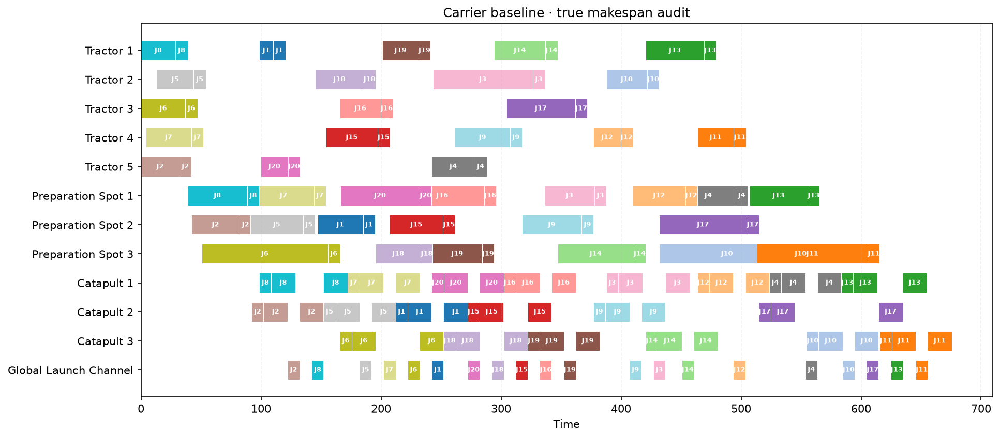

<div align="center">

# Schedule Lab

### 面向 JSP、FSP、FJSP、HFSP 与领域约束调度的可复现优化 Harness

Agent 负责诊断与实验编排；确定性算法负责构造候选；验证器与领域 Oracle 负责最终裁决。

[当前成果](#当前成果) · [系统能力](#系统能力) · [快速开始](#快速开始) · [项目结构](#项目结构) · [路线图](#路线图) · [更新规范](#持续更新规范)

</div>

---

> **项目状态：Active / Private Research Repository**
>
> 当前正式 incumbent：**627.8 s** · 相对 675.5 s 基线改善 **7.06%** · 测试 **25/25 passed**
>
> 最近整理：**2026-07-20**

## 项目定位

Schedule Lab 不是让 LLM 直接“猜”出一张甘特图，而是在已有稳定调度上持续改进的可审计框架：

```text
已有可行方案
  → 统一建模与瓶颈诊断
  → Agent 选择问题族策略、局部邻域与预算
  → VNS / ALNS / CP-SAT / 启发式构造候选
  → 通用硬约束验证
  → 可选领域 Oracle：轨迹、避碰、真实时间、状态依赖
  → 严格更优且复跑一致才更新 incumbent
```

核心原则：

- 从可信 incumbent 出发，不默认从头随机重排；
- 邻域外决策冻结，变化范围明确、可解释；
- Agent 选择实验，不直接编造开始时间或可行性结论；
- 求解器输出只是候选，验证器和 Oracle 才是验收依据；
- 固定 seed、稳定排序、单 worker 和候选哈希保证复现；
- 轨迹联合优化是可选增强 Tool，不是普通调度的安装前提。

## 当前成果

### 舰载机调度改进

| 阶段 | 真实 makespan | 状态 |
|---|---:|---|
| 原 greedy 基线 | 675.5 s | 已保存、可复现 |
| 受控搜索候选 | 637.5 s | 已通过领域环境与统一验证 |
| 确定性 ALNS · Iteration 1 | 636.2 s | 已验证 |
| 确定性 ALNS · Iteration 2 | 630.5 s | 已验证 |
| **当前正式 incumbent** | **627.8 s** | **已验证、当前保留** |

<table>
  <tr>
    <th width="50%">675.5 s · 原始基线</th>
    <th width="50%">627.8 s · 当前 incumbent</th>
  </tr>
  <tr>
    <td></td>
    <td></td>
  </tr>
</table>

- 相对 675.5 秒基线缩短 **47.7 秒 / 7.06%**；
- 相对 637.5 秒候选继续缩短 **9.7 秒 / 1.52%**；
- 完整 160 工序经过统一验证和原领域环境复跑；
- 当前方案：[`outputs/carrier_alns_best_iter3_gap6_closed_630_5.json`](outputs/carrier_alns_best_iter3_gap6_closed_630_5.json)；
- 同时间轴对比视频：[`carrier_schedule_comparison_637_5_vs_627_8.mp4`](outputs/videos/carrier_schedule_comparison_637_5_vs_627_8.mp4)。

> 文件名中的 `630_5` 是该轮输入基线的历史标记。文件内部按最晚工序结束时间重算的真实 makespan 为 627.8 秒；后续会在不破坏审计链的前提下统一产物命名。

### 通用问题族回归

| 问题族 | LPT incumbent | 自适应改进结果 | 当前结论 |
|---|---:|---:|---|
| JSP | 14 | **11** | 改善 |
| FSP | 22 | **19** | 改善 |
| FJSP | 11 | **7** | 改善 |
| HFSP | 17 | 17 | 当前有界邻域未改善 |

完整数据：[`outputs/adaptive_multifamily_improvement_benchmark.json`](outputs/adaptive_multifamily_improvement_benchmark.json)

### 验证边界

下列结果是实验诊断，不是正式成绩：

| 实验 | 抽象结果 | 领域结果 | 决策 |
|---|---:|---:|---|
| 固定 MAT 路线时空 CP-SAT | 619.5 s | 803.9 s，40 个绑定变化 | 拒绝 |
| 小规模路线绑定主问题 | 634.6 s | 未调用昂贵 Oracle | 因不优于 incumbent 而提前淘汰 |

这说明抽象求解器不能替代真实的机器可达性、车辆连续性、轨迹和碰撞环境。失败结果会转化为 no-good Cut 与因果闭包证据，而不会覆盖正式 incumbent。

## 系统能力

状态含义：**稳定** = 已进入默认路径；**实验** = 可复现但尚不能独立验收；**计划** = 尚未进入实现主线。

| 模块 | 状态 | 当前能力 |
|---|---|---|
| Canonical Scheduling IR | 稳定 | 统一 JSP、FSP、FJSP、HFSP、多模式工序和资源绑定 |
| 指标与验证器 | 稳定 | makespan、流动时间、延误、利用率、空闲、变更成本及硬约束验证 |
| 求解组合 | 稳定 | 派工启发式、PyJobShop、OR-Tools CP-SAT、warm start |
| Incumbent Improvement | 稳定 | fast → balanced 自适应短名单、确定性 VNS、局部修复 |
| 结构化大邻域 | 第一版 | 因果闭包、有界 ALNS、local branching、路径重连规划 |
| 证据控制 | 第一版 | Tabu/哈希去重、Oracle Cut、Beta-Binomial 与 Bayesian-UCB 排序 |
| 舰载机领域 Oracle | 已接入 | 原轨迹环境复算机器可达性、真实时间、车辆连续性和避碰等待 |
| 可视化与审计 | 稳定 | 甘特图、同时间轴对比视频、输入哈希和 manifest |
| CLI / MCP / Skill | 第一版 | 支持 Agent 调用分析、求解、改进、审计和实验规划 |
| 固定路线时空求解 | 实验 | 0.1 秒离散空间冲突预检查与 Cut 提取 |
| 联合调度—轨迹优化 | 可选实验 | 路线目录、LBBD 规划、固定路线子问题和绑定原型 |
| Agentic RL / Encoder | 计划 | 累积至少 500 条去重 post-Oracle 证据后再评估 |

更完整的成熟度、方法边界和分阶段计划见：

- [`SCHEDULE_LAB_PLAN.md`](SCHEDULE_LAB_PLAN.md) — 现有能力、技术计划与长期路线；
- [`EXPERIMENTS.md`](EXPERIMENTS.md) — 接受、拒绝和待验证实验记录；
- [`CHANGELOG.md`](CHANGELOG.md) — 面向持续更新的版本变更记录。

## 快速开始

### 1. 安装

```bash
git clone https://github.com/wgy577/schedule-lab.git
cd schedule-lab

python3 -m venv .venv
.venv/bin/pip install .
```

这是私有仓库，克隆账户需要相应访问权限。

### 2. 运行测试

```bash
.venv/bin/python -m unittest discover -s tests -v
```

### 3. 运行四类调度回归

```bash
.venv/bin/schedule-lab benchmark
.venv/bin/schedule-lab adaptive-improvement-benchmark --baseline-rule lpt
```

### 4. 审计已有舰载机调度

```bash
.venv/bin/schedule-lab carrier-audit
```

该命令只读审计，不会覆盖现有方案。舰载机专用命令依赖本地 legacy 项目、网络权重和 MAT 轨迹资源；通用 JSP/FSP/FJSP/HFSP 功能不依赖这些资源。

### 5. 生成确定性改进计划

```bash
.venv/bin/schedule-lab improvement-workflow \
  problem.json incumbent.json \
  --evidence-count 12 \
  --validated-elite-count 2 \
  --output outputs/improvement_workflow.json
```

### 6. 启动 MCP Server

```bash
.venv/bin/schedule-lab-mcp
```

主要 MCP 工具包括：

- `scheduling_capabilities`
- `analyze_schedule`
- `solve_problem`
- `compare_schedules`
- `plan_schedule_improvement`
- `fast_improve_schedule`
- `adaptive_improve_schedule`
- `plan_joint_schedule_and_trajectories`
- `audit_current_carrier`
- `search_current_carrier`

MCP 是 Agent 与算法的接口，不替代求解器、验证器或领域 Oracle。

## Harness 工作流

```text
Problem Adapter
  └─ Canonical Scheduling IR
      ├─ Metrics & Bottleneck Diagnosis
      ├─ Family Strategy Router
      │   ├─ JSP: critical blocks
      │   ├─ FSP: permutation / blocking
      │   ├─ FJSP: routing + sequencing
      │   └─ HFSP: stage load / sink gaps
      └─ Deterministic Search Controller
          ├─ VNS / exact enumeration
          ├─ CP-SAT local repair
          ├─ bounded ALNS
          └─ tabu + Bayesian budget allocation
              ↓
        Generic Validator
              ↓
        Optional Domain Oracle
              ↓
        Reproduce → Compare → Accept / Reject
```

## 项目结构

```text
schedule-lab/
├── README.md                      # GitHub 首页与快速入口
├── SCHEDULE_LAB_PLAN.md           # 能力边界、技术计划和长期路线
├── EXPERIMENTS.md                 # 实验登记与维护模板
├── CHANGELOG.md                   # 版本更新记录
├── pyproject.toml                 # Python 包与 CLI/MCP 入口
├── run_schedule_lab.py            # 仓库根目录兼容入口
├── src/schedule_lab/              # 核心模型、控制器、求解器和 Oracle 适配
├── tests/                         # 确定性回归测试
├── skills/                        # Agent 调度优化 Skill
├── workflows/                     # 备份、甘特图和对比视频工作流
└── outputs/                       # 已审计实验结果与展示产物
```

### 关键代码入口

| 目的 | 路径 |
|---|---|
| 统一模型 | [`src/schedule_lab/model.py`](src/schedule_lab/model.py) |
| 硬约束验证 | [`src/schedule_lab/validation.py`](src/schedule_lab/validation.py) |
| 快速自适应控制 | [`src/schedule_lab/fast_controller.py`](src/schedule_lab/fast_controller.py) |
| 通用邻域修复 | [`src/schedule_lab/generic_neighborhood.py`](src/schedule_lab/generic_neighborhood.py) |
| 方法路由 | [`src/schedule_lab/strategy_router.py`](src/schedule_lab/strategy_router.py) |
| 舰载机 ALNS | [`src/schedule_lab/carrier_alns.py`](src/schedule_lab/carrier_alns.py) |
| 领域 Oracle | [`src/schedule_lab/carrier_oracle.py`](src/schedule_lab/carrier_oracle.py) |
| 固定路线时空模型 | [`src/schedule_lab/carrier_spacetime.py`](src/schedule_lab/carrier_spacetime.py) |
| MCP Server | [`src/schedule_lab/mcp_server.py`](src/schedule_lab/mcp_server.py) |

## 路线图

| 阶段 | 目标 | 当前状态 |
|---|---|---|
| A | 固化 627.8 s 基线、哈希、Oracle 版本和复现命令 | 进行中 |
| B | 完善 JSP/FSP/FJSP/HFSP 快速通用优化器 | 进行中 |
| C | 在 627.8 s 上比较因果闭包、local branching、shifting bottleneck | 下一步 |
| D | 将轨迹能力整理为真正可插拔的增强 Tool | 规划中 |
| E | 用分层贝叶斯方法分配实验与 Oracle 预算 | 第一版已有 |
| F | 数据充足后评估 Agentic RL 与异构图 Encoder | 暂缓 |

详细验收标准见 [`SCHEDULE_LAB_PLAN.md`](SCHEDULE_LAB_PLAN.md#8-后续技术计划)。

## 持续更新规范

为了让后续结果可信、页面不会再次变成难以维护的长日志，每次更新按以下顺序进行：

1. **保留 incumbent**：记录规范化哈希、目标向量、验证状态和 Oracle 版本；
2. **登记实验**：在 [`EXPERIMENTS.md`](EXPERIMENTS.md) 添加一行，写清方法、释放范围、结果和结论；
3. **保存证据**：将必要 JSON、甘特图、视频和 manifest 放入 `outputs/`；
4. **只更新正式指标**：只有通过全部验证的候选才修改 README 顶部成绩；
5. **记录版本变化**：在 [`CHANGELOG.md`](CHANGELOG.md) 的 `Unreleased` 部分补充内容；
6. **运行测试**：至少执行完整 unittest；
7. **提交信息明确**：一次提交只对应一个可审计的能力或实验结论。

### 实验状态约定

| 标签 | 含义 |
|---|---|
| `ACCEPTED` | 通用验证和所需领域 Oracle 全部通过，目标严格改善，可成为 incumbent |
| `REJECTED` | 违反约束、领域回放失败、结果恶化或无法复现 |
| `PROVISIONAL` | 抽象模型成立，但尚未通过完整领域验证 |
| `PLANNED` | 已定义目标和方法，尚未执行 |

## 安全与正确性边界

- 甘特图更紧凑不等于方案可行；
- CP-SAT 的抽象最优不等于真实领域最优；
- 概率模型和 Agent 只能分配实验预算，不能绕过约束；
- 新舰载机候选必须重新通过原轨迹/碰撞 Oracle；
- 任何正式更新都必须保留失败候选、接受理由和复现命令；
- 联合轨迹 Tool 缺失时，通用调度能力应继续正常工作。

---

<div align="center">

**Current validated carrier incumbent: 627.8 s**

详细计划请从 [`SCHEDULE_LAB_PLAN.md`](SCHEDULE_LAB_PLAN.md) 开始阅读。

</div>
