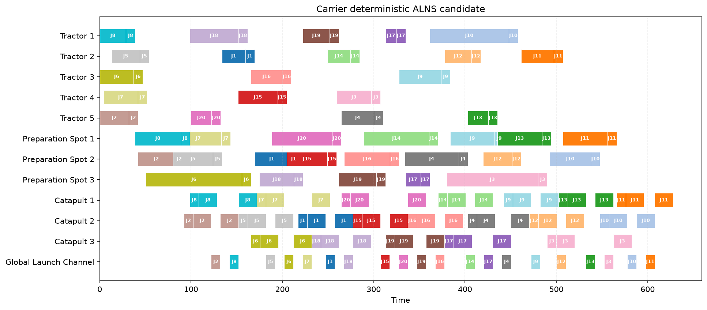

# Schedule Lab

[简体中文](README.md) | **English**

[](pyproject.toml)
[](CHANGELOG.md)
[](tests/test_schedule_lab.py)
[](SCHEDULE_LAB_PLAN.md)
[](#license)

A deterministic and auditable optimization framework for JSP, FSP, FJSP, HFSP, and domain-constrained scheduling.

Schedule Lab improves an existing feasible schedule instead of asking an LLM to generate an unchecked Gantt chart. An Agent diagnoses bottlenecks and selects a bounded search strategy; heuristics and exact solvers construct candidates; validators and domain Oracles make the final acceptance decision.

## Table of Contents

- [Overview](#overview)
- [Key Features](#key-features)
- [Current Results](#current-results)
- [Architecture](#architecture)
- [Installation](#installation)
- [Usage](#usage)
- [MCP Server](#mcp-server)
- [Repository Structure](#repository-structure)
- [Documentation](#documentation)
- [Roadmap](#roadmap)
- [Contributing](#contributing)
- [License](#license)

## Overview

```text
Feasible incumbent
  → normalize and audit
  → diagnose bottlenecks
  → select a bounded neighborhood
  → deterministic repair
  → generic validation
  → optional domain Oracle
  → reproduce and accept or reject
```

Design principles:

- Improve a trusted incumbent rather than restarting randomly by default.
- Freeze every decision outside the declared neighborhood.
- Let the Agent select experiments, not fabricate start times or feasibility claims.
- Treat solver output as a candidate until every required validation gate passes.
- Use fixed seeds, stable ordering, one solver worker, and normalized hashes.
- Keep joint trajectory optimization optional for generic scheduling workflows.

## Key Features

| Category | Capabilities | Status |
|---|---|---|
| Problem families | JSP, FSP, FJSP, HFSP, and hybrid domain problems | Stable |
| Modeling | Multi-mode operations, eligible machines, capacities, arbitrary precedence, resource bindings | Stable |
| Solvers | Dispatching heuristics, PyJobShop, OR-Tools CP-SAT | Stable |
| Improvement | Compaction, VNS, local CP-SAT, causal closure, bounded ALNS | Stable / v1 |
| Search control | Tabu hashes, fast-to-balanced escalation, Bayesian evidence ranking | Stable / v1 |
| Validation | Hard constraints, frozen-region checks, recomputed true metrics | Stable |
| Domain Oracle | Carrier trajectories, collision delays, vehicle continuity, dynamic reachability | Integrated |
| Interfaces | Python API, CLI, MCP Server, Codex Skill | Available |
| Visualization | Gantt charts, shared-clock comparison video, audit manifest | Available |
| Joint trajectories | Route catalog, fixed-route space-time model, Oracle Cuts | Experimental |
| Agentic RL | Search control and graph encoders | Planned |

## Current Results

### Carrier scheduling

| Stage | True makespan | Validation |
|---|---:|---|
| Greedy baseline | 675.5 s | Reproducible baseline |
| Controlled policy search | 637.5 s | Generic and domain validated |
| Deterministic ALNS iteration 1 | 636.2 s | Validated |
| Deterministic ALNS iteration 2 | 630.5 s | Validated |
| **Current incumbent** | **627.8 s** | **Validated** |

The current incumbent improves the 675.5-second baseline by **47.7 seconds / 7.06%**.



Key artifacts:

- [Current 627.8-second schedule](outputs/carrier_alns_best_iter3_gap6_closed_630_5.json)
- [Original 675.5-second baseline](outputs/carrier_greedy_baseline_675_5.json)
- [637.5 vs 627.8 comparison video](outputs/videos/carrier_schedule_comparison_637_5_vs_627_8.mp4)
- [Comparison audit manifest](outputs/videos/carrier_schedule_comparison_637_5_vs_627_8.manifest.json)

> The `630_5` filename is retained for historical traceability because 630.5 seconds was the input incumbent of that iteration. The stored schedule has a recomputed true makespan of 627.8 seconds.

### Multi-family regression

| Family | LPT incumbent | Improved schedule | Result |
|---|---:|---:|---|
| JSP | 14 | **11** | Improved |
| FSP | 22 | **19** | Improved |
| FJSP | 11 | **7** | Improved |
| HFSP | 17 | 17 | No improvement in the current bounded neighborhood |

See the [complete adaptive benchmark](outputs/adaptive_multifamily_improvement_benchmark.json).

### Rejected experimental candidates

| Experiment | Abstract result | Domain result | Decision |
|---|---:|---:|---|
| Fixed-route space-time CP-SAT | 619.5 s | 803.9 s and 40 binding changes | Rejected |
| Bounded route-binding master | 634.6 s | Not sent to the expensive Oracle | Rejected before Oracle |

An abstract solver objective is never reported as a formal improvement unless all required validators and domain replay gates pass.

## Architecture

```text
Problem Adapter
└── Canonical Scheduling IR
    ├── Metrics and Bottleneck Diagnosis
    ├── Family Strategy Router
    │   ├── JSP: critical blocks
    │   ├── FSP: permutation and blocking
    │   ├── FJSP: routing and sequencing
    │   └── HFSP: stage load and sink gaps
    └── Deterministic Search Controller
        ├── VNS and exact enumeration
        ├── CP-SAT local repair
        ├── bounded ALNS
        └── tabu and Bayesian budget allocation
            ↓
      Generic Validator
            ↓
      Optional Domain Oracle
            ↓
      Reproduce → Compare → Accept / Reject
```

### Responsibility boundaries

| Component | Responsibility |
|---|---|
| Agent | Diagnose bottlenecks and select the strategy, neighborhood, and budget |
| Heuristics / VNS / ALNS | Generate structured proposals |
| CP-SAT / exact methods | Construct legal assignments inside the released region |
| Generic validator | Check precedence, resources, eligibility, bindings, and frozen decisions |
| Domain Oracle | Check trajectories, collisions, state-dependent reachability, and real timing |
| Human reviewer | Confirm objectives, risk thresholds, and formal release decisions |

## Installation

### Requirements

- Python 3.11 or later
- macOS, Linux, or Windows
- Access to this private repository

### Setup

```bash
git clone https://github.com/wgy577/schedule-lab.git
cd schedule-lab

python3 -m venv .venv
.venv/bin/pip install .
```

Carrier-specific commands additionally require the local legacy project, trained network weights, and MAT trajectory resources. Generic JSP/FSP/FJSP/HFSP workflows do not require those assets.

## Usage

### Run the test suite

```bash
.venv/bin/python -m unittest discover -s tests -v
```

### Run the scheduling benchmark

```bash
.venv/bin/schedule-lab benchmark
```

### Run the adaptive multi-family benchmark

```bash
.venv/bin/schedule-lab adaptive-improvement-benchmark --baseline-rule lpt
```

### Analyze and improve an incumbent

```bash
.venv/bin/schedule-lab improvement-workflow \
  problem.json incumbent.json \
  --evidence-count 12 \
  --validated-elite-count 2 \
  --output outputs/improvement_workflow.json
```

### Audit the carrier schedule

```bash
.venv/bin/schedule-lab carrier-audit
```

The audit command is read-only and does not replace the current schedule.

### Render the comparison video

```bash
python3 workflows/video/render_schedule_comparison.py
```

The comparison uses one shared time scale. The shorter schedule remains on its final frame while the longer schedule finishes; the two sides are never independently normalized to the same duration.

## MCP Server

Start the server:

```bash
.venv/bin/schedule-lab-mcp
```

Available tools include:

- `scheduling_capabilities`
- `analyze_schedule`
- `solve_problem`
- `compare_schedules`
- `plan_schedule_improvement`
- `fast_improve_schedule`
- `adaptive_improve_schedule`
- `plan_joint_schedule_and_trajectories`
- `audit_current_carrier`
- `search_current_carrier`

The MCP layer exposes scheduling capabilities to an Agent. It does not replace the solver, validator, or domain Oracle.

## Repository Structure

```text
schedule-lab/
├── README.md
├── README_EN.md
├── CHANGELOG.md
├── EXPERIMENTS.md
├── SCHEDULE_LAB_PLAN.md
├── pyproject.toml
├── run_schedule_lab.py
├── src/schedule_lab/
├── tests/
├── skills/
├── workflows/
└── outputs/
```

## Documentation

| Document | Purpose |
|---|---|
| [Technical plan and roadmap](SCHEDULE_LAB_PLAN.md) | Current capabilities, architecture, risks, and phased development plan |
| [Experiment log](EXPERIMENTS.md) | Accepted, rejected, provisional, and planned experiments |
| [Changelog](CHANGELOG.md) | Versioned repository updates |
| [Optimization Skill](skills/improve-schedules-with-oracles/SKILL.md) | Reusable Agent workflow and validation rules |
| [Method selection](skills/improve-schedules-with-oracles/references/method-selection.md) | Problem-family and method routing guidance |
| [Advanced portfolio](skills/improve-schedules-with-oracles/references/advanced-optimization-portfolio.md) | Decomposition, path relinking, Oracle Cuts, and robust optimization |
| [Joint schedule-trajectory design](skills/improve-schedules-with-oracles/references/agentic-rl-and-joint-trajectories.md) | Optional trajectory Tool and Agentic RL boundaries |
| [Comparison video contract](workflows/video/COMPARISON_VIDEO_TEMPLATE.md) | Shared-clock rendering and audit requirements |

## Roadmap

- [x] Unified JSP/FSP/FJSP/HFSP problem representation
- [x] Deterministic validation and metric audit
- [x] VNS, local CP-SAT, and bounded ALNS workflow
- [x] Carrier trajectory/collision Oracle integration
- [x] Tabu signatures, Oracle Cuts, and Bayesian evidence ranking
- [x] Validated carrier improvement from 675.5 to 627.8 seconds
- [ ] Standardize the 627.8-second incumbent artifact and reproduction manifest
- [ ] Compare causal closure, local branching, and shifting bottleneck on the current incumbent
- [ ] Expand the multi-family benchmark suite
- [ ] Package trajectory optimization as a fully optional Tool
- [ ] Add robustness scenarios and lexicographic multi-objective acceptance
- [ ] Evaluate Agentic RL and graph encoders after sufficient validated evidence exists

Detailed milestones and acceptance criteria are maintained in [SCHEDULE_LAB_PLAN.md](SCHEDULE_LAB_PLAN.md#8-后续技术计划).

## Contributing

This repository is updated around validated experiments rather than unverified solver output.

Before submitting a change:

1. Preserve and hash the current incumbent.
2. Record the experiment in [EXPERIMENTS.md](EXPERIMENTS.md).
3. Keep every decision outside the declared neighborhood frozen.
4. Run generic validation and the required domain Oracle.
5. Reproduce accepted candidates and compare normalized hashes.
6. Update [CHANGELOG.md](CHANGELOG.md) under `Unreleased`.
7. Run the full test suite.

Experiment labels:

- `ACCEPTED`: all required validation gates pass and the objective strictly improves;
- `REJECTED`: infeasible, worse, unstable, or unreproducible;
- `PROVISIONAL`: valid only in an abstraction and awaiting domain validation;
- `PLANNED`: specified but not yet executed.

## License

This is a private research repository. No public license is currently granted. Do not redistribute source code, models, trajectory assets, or experimental artifacts without permission from the repository owner.
