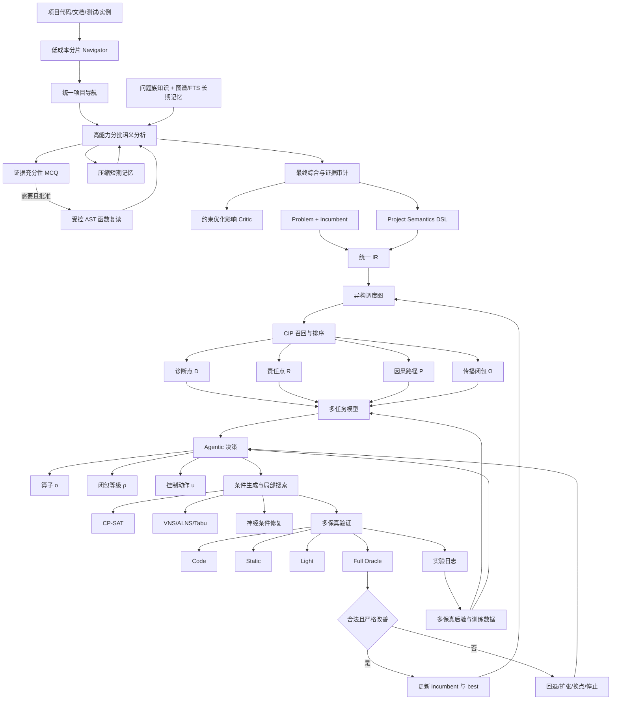

# Causal Schedule Lab 详细框架

> 文档性质：项目架构的唯一详细基线  
> 当前软件版本：`0.5.0`  
> 最近代码核验：`2026-07-25`  
> 维护入口：`.agents/skills/maintain-causal-schedule-lab/SKILL.md`

## 目录

1. [文档目的与状态定义](#1-文档目的与状态定义)
2. [研究目标与系统边界](#2-研究目标与系统边界)
3. [总体架构](#3-总体架构)
4. [当前实际运行链](#4-当前实际运行链)
5. [分层模块现状](#5-分层模块现状)
6. [核心数据契约](#6-核心数据契约)
7. [数学框架实现概况](#7-数学框架实现概况)
8. [训练阶段](#8-训练阶段)
9. [验证、Oracle 与接受机制](#9-验证oracle-与接受机制)
10. [搜索、停止与成本模型](#10-搜索停止与成本模型)
11. [实验与统计体系](#11-实验与统计体系)
12. [人与 Agent 的职责边界](#12-人与-agent-的职责边界)
13. [当前能力与关键缺口](#13-当前能力与关键缺口)
14. [扩展新调度项目](#14-扩展新调度项目)
15. [文档持续维护规则](#15-文档持续维护规则)
16. [验证命令](#16-验证命令)

## 1. 文档目的与状态定义

本文件描述当前代码真实具备的能力，不描述尚未运行的假想结果。所有模块使用
以下状态：

| 状态 | 含义 |
|---|---|
| **主闭环已运行** | 已被默认控制器调用，并有端到端测试或 smoke 产物 |
| **代码已实现但未接入** | 有可执行实现和局部测试，但默认在线控制器没有使用 |
| **接口已预留** | 数据结构、协议或插件位置存在，仍需要实现或外部输入 |
| **尚未实现** | 原框架要求存在，但当前没有足够代码支撑 |
| **外部责任** | 必须由实例、领域专家、真实 Oracle 或算力环境提供 |

禁止把“类已经定义”“可以 import”或“小例子运行”写成“模型已经训练完成”。

## 2. 研究目标与系统边界

### 2.1 目标

从一个稳定、可验证的 incumbent 调度方案出发，寻找小而可控的因果干预区域，
在保持所有硬约束的前提下持续改进，直到预算耗尽或多尺度邻域无法再发现改善。

支持的问题族：

- JSP；
- FSP；
- FJSP；
- HFSP；
- 通过统一 IR 与领域 Oracle 接入的混合约束调度。

### 2.2 不采用的方式

- 不让 LLM 直接输出整张甘特图并宣称可行；
- 不默认从零重新求解；
- 不依赖无上限随机多启动碰运气；
- 不用轻量代理结果替代正式 Oracle；
- 不允许学习模型绕过硬约束；
- 不在没有实验数据时声称跨问题族泛化成功或达到全局最优。

### 2.3 输入

```text
Problem
  作业、工序、资源、模式、优先关系、日历、时间窗、绑定、目标

Incumbent Schedule
  每道工序的 mode、start、end、route 与来源

Project Semantics
  问题族、硬约束、可修改决策、允许算子、Oracle 门、证据

Optional Domain Oracle
  仿真、数字孪生、轨迹、人员/车辆连续性或其他未显式建模规则
```

### 2.4 输出

- 通过完整验证且严格优于 incumbent 的 schedule；
- 所有候选的接受或拒绝日志；
- CIP、动作、闭包、验证成本和失败标签；
- 历史最好目标向量；
- 可重放实验记录和统计报告。

## 3. 总体架构



共享调度因果骨架：

```text
上游状态 A → 局部到达 L → 等待 W → 开始 T → 时长 D → 目标 J
```

该骨架是跨问题族的共享语义，不表示所有项目使用完全相同的具体约束。

## 4. 当前实际运行链

当前默认 CLI 和 `AgenticImprovementController` 真正执行：

```text
读取 manifest
  → 加载 Problem / Incumbent / Semantics
  → 代码证据门
  → 构建调度图
  → 规则召回 CIP
  → 规则排序 + 简化 Masked policy
  → 释放闭包并冻结其余工序
  → CP-SAT 局部修复
  → Static
  → Light
  → Full
  → 严格改善才接受
  → 记录 JSONL
```

当前主闭环没有直接使用：

- 训练后的关系 GNN 权重；
- 完整三元层级 Agent 动作；
- 学习式神经条件生成器；
- 条件化多保真偏差模型；
- 自动执行的三组因果对照；
- Token 成本奖励；
- 严格的“所有邻域穷尽后收敛”判定。

## 5. 分层模块现状

### 5.1 项目语义与适配层

| 模块 | 文件 | 状态 | 当前能力 | 缺口 |
|---|---|---|---|---|
| 项目 manifest | `src/causal_schedule_lab/project.py` | 主闭环已运行 | 解析 adapter、semantics、generator、Oracle | 需要真实项目 adapter |
| 统一 JSON I/O | `src/causal_schedule_lab/io.py` | 主闭环已运行 | Problem/Schedule 读写 | 需扩充公开数据集 importer |
| 语义模型 | `src/causal_schedule_lab/models.py` | 主闭环已运行 | claim、evidence、resource、binding、objective | 更丰富 DSL 仍可扩展 |
| 语义证据审计 | `src/causal_schedule_lab/semantics.py` | 主闭环已运行 | verified 声明必须有机械证据 | 尚未验证证据表达的业务真实性 |
| 调度问题族知识库 | `src/causal_schedule_lab/semantic_knowledge.py`、`src/causal_schedule_lab/knowledge/scheduling_families.json` | 主闭环已运行 | JSP/FSP/HFSP/FJSP 精确别名、常见变体、八类跨族工程模式与来源检索 | 知识种子仍需多案例和领域专家审订 |
| 图谱长期记忆 | `src/causal_schedule_lab/storage/graph_store.py` | 代码已实现但未接入 | SQLite 属性图、版本、作用域、别名、证据、干预记录和统计 | 默认语义/CIP 未消费；缺人工审核工作流 |
| 分层证据检索与迁移 | `src/causal_schedule_lab/storage/memory.py` | 代码已实现但未接入 | L0–L4 FTS5、图邻域、种子幂等迁移、PDF/文本 proposed 导入 | 缺默认语义链接入、冲突审核和可选 reranker |
| 约束优化影响 Critic | `src/causal_schedule_lab/constraint_impact.py` | 代码已实现但未接入 | 四维枚举档位、固定数值映射、可控性/候选变化选择题、独立 Provider、硬约束保留门 | 尚无在线 Artifact 和人工权重校准；控制器未消费 |
| 项目语义编译 | `src/causal_schedule_lab/semantic_compiler.py` | 接口已预留 | 程序索引、提案协议、verified/unknown 证据门 | 缺生产 LLM Provider、多轮项目理解和人工审核流 |
| LLM 单轮受约束语义解析 | `src/causal_schedule_lab/llm_semantics.py` | 代码已实现但未进入默认 manifest | 证据包、选择题 Schema、JSON 修复、引用审计；已完成真实 Provider smoke | 不适合超长跨文件项目；保留作回归基线 |
| 分阶段语义 Agent | `src/causal_schedule_lab/semantic_agent.py` | 代码已实现但未接入 | 低成本分片导航、三批高能力分析、证据充分性选择题、受控 AST 复读、短期记忆、最终综合 | 尚未用人工确认标签运行正式在线对照；未进入默认 runtime |
| 论文—代码语义盲测 | `src/causal_schedule_lab/semantic_harness.py` | 代码已实现但未进入默认 manifest | 论文 draft 标签、代码读取规划、白名单证据包、八类语义评分、逐阶段成本 | 仅完成一个网上案例；旧评分混合事实层，已建立人工核验表，标签尚未确认 |
| Provider 契约 | `src/causal_schedule_lab/providers/base.py` | 代码已实现 | 请求、响应、Token 和模型元数据 | 后续纳入统一 runtime |
| 火山/OpenAI 兼容 Provider | `src/causal_schedule_lab/providers/openai_compatible.py` | 主链已实测 | `.env`、HTTPS、JSON mode、重试、脱敏错误；按模型适配最高推理档并记录 reasoning 元数据 | 缺预算持久化和熔断状态 |
| Anthropic Messages 兼容 Provider | `src/causal_schedule_lab/providers/anthropic_compatible.py` | 代码已实现但未进入默认 manifest | Claude 中转、adaptive thinking、max effort、Token/延迟、网络重试 | 最高质量协议在线 smoke 遇上游暂时不可用；中转身份只能信任网关 |
| 插件解析 | `src/causal_schedule_lab/plugins.py` | 主闭环已运行 | generator 与 domain Oracle 工厂 | 外部插件由具体项目提供 |

### 5.2 统一 IR 与目标层

| 模块 | 文件 | 状态 | 当前能力 | 缺口 |
|---|---|---|---|---|
| Canonical IR | `src/causal_schedule_lab/ir.py` | 主闭环已运行 | JSP/FSP/FJSP/HFSP、模式、资源、约束、目标 | 复杂 sequence-dependent setup 的求解编码不完整 |
| 通用指标 | `src/causal_schedule_lab/metrics.py` | 主闭环已运行 | makespan、tardiness、flow、energy、cost、change | 鲁棒性与风险需项目定义 |
| 词典序目标 | `src/causal_schedule_lab/objective.py` | 主闭环已运行 | 多目标方向、容差、严格比较 | 尚未自动学习目标权重 |
| 内置基准 | `src/causal_schedule_lab/benchmarks.py` | 主闭环已运行 | 四类小实例和 seeded FJSP | 尚未接入大规模公开 benchmark |

### 5.3 图、CIP 与因果层

| 模块 | 文件 | 状态 | 当前能力 | 缺口 |
|---|---|---|---|---|
| 异构调度图 | `src/causal_schedule_lab/graph.py` | 主闭环已运行 | operation/job/resource/stage 与八类边 | 不是已识别的结构因果模型 |
| Tensor 转换 | `src/causal_schedule_lab/tensorization.py` | 代码已实现但未接入 | 图和 CIP 转为 Torch batch | 默认 ranker 未调用 |
| CIP 召回 | `src/causal_schedule_lab/cip.py` | 主闭环已运行 | idle gap、critical block、resource imbalance | blocking、setup 等诊断仍需扩充 |
| 规则闭包 | `src/causal_schedule_lab/cip.py` | 主闭环已运行 | 作业后缀、资源邻居、1–3 级扩张 | 未被学习式闭包替换 |
| 规则排序 | `src/causal_schedule_lab/cip.py` | 主闭环已运行 | gain/validity/cost/uncertainty 启发式 | 不等同于训练后的 \(q_\phi\) |
| 反事实控制定义 | `src/causal_schedule_lab/counterfactuals.py` | 代码已实现但未接入 | 三种随机对照和多 incumbent | 主循环未自动执行配对对照 |
| 因果机制目标与资格门 | `src/causal_schedule_lab/mechanisms.py` | 代码已实现但未接入 | 八类机制测量、候选变化硬门、直接/验证间接控制门、保守效应后验 | 缺真实 replay、跨族校准和 Agent 接入 |

### 5.4 学习模型层

| 模块 | 文件 | 状态 | 当前能力 | 缺口 |
|---|---|---|---|---|
| 关系 GNN | `src/causal_schedule_lab/learning.py` | 代码已实现但未接入 | relation-specific message passing | 无正式训练 checkpoint |
| 多任务头 | `src/causal_schedule_lab/learning.py` | 代码已实现但未接入 | improvement/validity/cost/risk/rank/path/closure | 缺真实标签训练 |
| MLP 基线 | `src/causal_schedule_lab/learning.py` | 代码已实现但未接入 | 图无关消融基线 | 缺实验 |
| 联合损失 | `src/causal_schedule_lab/learning.py` | 代码已实现但未接入 | 回归、BCE、pairwise、sparse | 权重尚未调优 |
| 训练器 | `src/causal_schedule_lab/trainers.py` | 代码已实现但未接入 | 确定性训练、验证、checkpoint | 没有正式 dataset pipeline 调用 |

### 5.5 Agentic 决策层

| 模块 | 文件 | 状态 | 当前能力 | 缺口 |
|---|---|---|---|---|
| 简化状态编码 | `src/causal_schedule_lab/agent.py` | 主闭环已运行 | 16 维 CIP/预算/失败特征 | 未使用 GNN 路径与闭包 embedding |
| 简化 Masked PPO | `src/causal_schedule_lab/agent.py` | 主闭环已运行 | \(o,\rho\) 选择、BC、clipped PPO 更新 | 在线主循环没有收集并训练 transition |
| 完整三元动作 | `src/causal_schedule_lab/agentic_rl.py` | 代码已实现但未接入 | \(o,\rho,u\) 与合法性 Mask | 默认 controller 未使用 |
| 完整/轻量奖励 | `src/causal_schedule_lab/agentic_rl.py` | 代码已实现但未接入 | 改善、best、因果、成本、闭包、风险 | 时间/Token 和真实因果效应未注入 |
| 离线 AWBC | `src/causal_schedule_lab/agentic_rl.py` | 代码已实现但未接入 | advantage weighted BC loss | 没有 IQL/CQL 和离线训练任务 |

### 5.6 局部搜索与条件生成层

| 模块 | 文件 | 状态 | 当前能力 | 缺口 |
|---|---|---|---|---|
| 干预构造 | `src/causal_schedule_lab/operators.py` | 主闭环已运行 | released/frozen、priority/mode override、签名 | 部分 override 尚未被 CP-SAT 消费 |
| 通用 repair 协议 | `src/causal_schedule_lab/repair.py` | 主闭环已运行 | CP-SAT repair 封装 | 主要使用 frozen set，算子语义较弱 |
| CP-SAT | `src/causal_schedule_lab/solvers/cp_sat.py` | 主闭环已运行 | 模式、容量、precedence、choice、窗口、no-wait、冻结、词典序 | setup/binding 等复杂约束需插件或继续编码 |
| Dispatching | `src/causal_schedule_lab/solvers/dispatching.py` | 主闭环已运行 | 确定性 baseline | 仅用于初始解与 smoke |
| VNS/ALNS/Tabu portfolio | `src/causal_schedule_lab/search.py` | 代码已实现但未接入 | 有序 proposal、平台期切换、tabu、acquisition | 未驱动默认 controller |
| 部分排程编码 | `src/causal_schedule_lab/conditional_generator.py` | 代码已实现但未接入 | 每轮重新编码、destroy/reconstruct 样本 | 特征仍较轻量 |
| 神经修复策略 | `src/causal_schedule_lab/conditional_generator.py` | 代码已实现但未接入 | mode 与 start preference | 缺 construct/feasible 完整损失 |
| Solver-backed 多候选 | `src/causal_schedule_lab/conditional_generator.py` | 代码已实现但未接入 | 多 seed 确定性候选接口 | 多 seed 与完全确定性研究目标需谨慎解释 |

### 5.7 验证、后验与接受层

| 模块 | 文件 | 状态 | 当前能力 | 缺口 |
|---|---|---|---|---|
| 通用硬约束 | `src/causal_schedule_lab/core_validation.py` | 主闭环已运行 | completeness、eligibility、duration、release、precedence、capacity、calendar、window、lag、binding、setup | 未覆盖的项目约束必须走 Oracle |
| 多保真验证 | `src/causal_schedule_lab/validation.py` | 主闭环已运行 | Code/Static/Light/Full | Light 仍是规则代理 |
| 严格接受 | `src/causal_schedule_lab/controller.py` | 主闭环已运行 | Full 通过且目标严格改善才更新 | 尚未实现多尺度收敛证明式停止 |
| Full Oracle 预算 | `src/causal_schedule_lab/controller.py` | 主闭环已运行 | 次数限制 | 预算选择未完全使用 acquisition |
| 多保真后验 | `src/causal_schedule_lab/posterior.py` | 代码已实现但部分接入 | Beta validity、gain/cost、Light-Full 平均偏差 | 不是条件化 \(b_\ell(h,a)\) 模型 |
| 审计日志 | `src/causal_schedule_lab/audit.py` | 主闭环已运行 | JSONL 保存和重载 | Token、环境版本和外部 Oracle ID 可扩展 |

### 5.8 数据、训练、反思与统计层

| 模块 | 文件 | 状态 | 当前能力 | 缺口 |
|---|---|---|---|---|
| 数据导出 | `src/causal_schedule_lab/dataset.py` | 代码已实现但未形成正式语料 | training row、pairwise、closure label | 需要真实反事实记录 |
| 阶段流水线 | `src/causal_schedule_lab/training_pipeline.py` | 代码已实现但未运行全阶段 | 阶段 0–8、依赖、resume、拒绝伪完成 | 缺每阶段正式 runner 注册 |
| 实验 runner | `src/causal_schedule_lab/experiment_runner.py` | 代码已实现但未跑公开基准 | method × case × seed | 缺大规模实例与算力 |
| 实验指标 | `src/causal_schedule_lab/experiments.py` | 代码已实现 | ranking、improvement、control plan | 缺正式实验输出 |
| 统计 | `src/causal_schedule_lab/statistics.py` | 代码已实现 | bootstrap、Wilcoxon、Cliff、Friedman、Holm | 缺足够样本 |
| LLM 反思 | `src/causal_schedule_lab/reflection.py` | 代码已实现但未接入 | trigger、证据、held-out replay、隔离 | 尚未成为阶段 8 runner |
| CLI | `src/causal_schedule_lab/cli.py` | 主闭环已运行 | audit、inspect、optimize、demo、train、export | 命令尚未覆盖全训练流水线 |

### 5.9 Headroom 上下文基础设施

当前本机状态：

- Headroom `0.32.1` 已安装为隔离 `uv tool`；
- Codex 和 Claude Code MCP 已注册；
- Headroom Proxy 默认不启动；
- 不存在常驻 Headroom 代理进程；
- `learn` 已能扫描历史会话，但当前目录没有 Git 信任上下文，尚未生成规则；
- Token 使用尚未写入 `ExperimentRecord`。

使用原则：

- 只压缩 Agent 看到的日志、JSON 和工具输出；
- 训练数据与 Oracle 始终读取原始文件；
- `learn --apply` 前必须人工审核；
- 不把 Headroom 压缩结果当成事实证据；
- 代理模式按任务显式开启，任务结束后关闭。

## 6. 核心数据契约

### 6.1 Problem

`src/causal_schedule_lab/ir.py` 的 `Problem` 是所有项目的唯一核心输入：

```text
Problem
├── jobs
├── resources
├── operations
│   └── modes
├── choice_links
├── constraints
├── objective
├── time_scale
└── metadata
```

约束必须明确标记：

- `core`：通用验证器负责；
- `solver`：求解器编码负责；
- `oracle`：外部领域 Oracle 负责。

不得静默丢弃约束。

### 6.2 Schedule

每个 operation 只能有一个 assignment：

```text
Assignment = operation_id + mode_id + start + end + route_id + provenance
```

闭包外固定比较只使用调度语义字段，不因 provenance 不同误判。

### 6.3 CIP

\[
h=(D,R,P,\Omega)
\]

- \(D\)：损失显现位置；
- \(R\)：真正可修改的责任决策；
- \(P\)：责任点影响目标的路径；
- \(\Omega\)：为保持传播一致性必须共同释放的区域。

### 6.4 AgentAction

\[
a=(o,\rho,u)
\]

- \(o\)：swap、insert、resequence、reassign 等算子；
- \(\rho\)：闭包等级 1–3；
- \(u\)：Retry、Expand、NextCIP、Backtrack、FullOracle、StopLocal、
  StopGlobal。

### 6.5 ExperimentRecord

必须保存：

- project/instance/incumbent hash；
- incumbent objective；
- CIP 四元结构；
- Agent action；
- proposal signature；
- 每级 verification；
- accepted/new objective/delta/best updated；
- actual closure/outside changes；
- runtime；
- policy、generator 和目标向量元数据。

计划新增：

- input/output/cached/retrieval Token；
- Token 费用；
- solver、Oracle、模型和环境版本；
- paired causal control ID；
- episode 和 transition ID。

## 7. 数学框架实现概况

详细逐公式状态见
[FORMULA_IMPLEMENTATION_MATRIX.md](FORMULA_IMPLEMENTATION_MATRIX.md)。

因果模块从语义、异构图、反事实数据到 CIP 模型接入的逐阶段任务，见
[CAUSAL_MODULE_WORKPLAN.md](CAUSAL_MODULE_WORKPLAN.md)。

当前最高优先级调整为先完成可替换、可恢复、可审计的 Agent 平台壳，见
[AGENT_PLATFORM_WORKPLAN.md](AGENT_PLATFORM_WORKPLAN.md)。平台壳验收前不开始
大规模反事实采集和模型训练。

当前结论：

- 数据结构与确定性调度安全公式完成度最高；
- 多任务损失、BC、PPO、奖励与后验已有代码；
- 严格反事实责任价值、条件化多保真偏差、Token 成本和完整生成器损失尚未闭环；
- “写出公式对应函数”和“训练并进入默认控制器”必须分开记录。

## 8. 训练阶段

| 阶段 | 目标 | 当前状态 | 完成条件 |
|---:|---|---|---|
| 0 | 项目语义构建 | 代码具备 | 真实项目 DSL、证据和 Oracle 全部通过 |
| 1 | 反事实数据生成 | 部分具备 | 多 incumbent、动作、闭包、对照和多保真记录 |
| 2 | CIP 排序训练 | 模型具备 | train/val/test 按实例划分并保存 checkpoint |
| 3 | 路径和闭包训练 | 模型具备 | 保留闭包不足失败样本并完成稀疏训练 |
| 4 | 条件生成器修复训练 | 部分具备 | construct、repair、feasible 三项损失完整 |
| 5 | Agent 行为克隆 | smoke 已运行 | 使用单位成本收益最好的验证动作 |
| 6 | 离线 RL | 仅 AWBC 原语 | 完成训练 runner 和离线评估 |
| 7 | 在线 Masked PPO | PPO 原语具备 | 短时程 episode、完整奖励、预算和回退接通 |
| 8 | LLM 反思与蒸馏 | 安全接口具备 | 新规则经证据与 held-out replay 后加入 |

任何阶段没有生成规定 artifact 时，`TrainingPipeline` 必须拒绝标记 completed。

## 9. 验证、Oracle 与接受机制

### 9.1 四级验证

```text
Level 0 Code
  语义 claim 是否具有代码/测试/文档证据

Level 1 Static
  完整性、闭包边界、通用硬约束、冻结区

Level 2 Light
  快速目标代理、模式变化、瓶颈转移风险

Level 3 Full
  完整通用验证 + 可选真实项目 Oracle + 真实目标
```

### 9.2 接受规则

候选只有同时满足以下条件才更新 incumbent：

1. 生成器返回 schedule；
2. Static 通过；
3. Light 通过；
4. Full 通过；
5. 目标向量按项目词典序严格改善。

否则：

- 当前 incumbent 不变；
- 历史 best 不变；
- 失败原因进入日志；
- 后续可以 Retry、Expand、NextCIP 或 Stop。

### 9.3 Oracle 责任

通用 Oracle 可以验证统一 IR 中显式表达的约束。以下内容通常属于外部责任：

- 仿真状态；
- 轨迹、碰撞和运输连续性；
- 人员与车辆连续性；
- 设备切换的真实时间；
- 企业规则和不可公开约束；
- 随机扰动下的鲁棒性。

## 10. 搜索、停止与成本模型

### 10.1 当前搜索

- CIP 按规则分数排序；
- 每个 CIP 选择一个受 Mask 约束的动作；
- CP-SAT 在冻结边界内修复；
- 找到第一个完整改善后更新并重新构图；
- 固定 `max_iterations`、`candidate_budget`、`full_oracle_budget`。

### 10.2 目标搜索

后续应形成：

```text
半径 1 VNS
  → 半径 2/3
  → bounded ALNS
  → tabu 防重复
  → posterior/acquisition 分配 Full Oracle
  → 多轮无改善与置信停止
```

“优化到不能优化”为预算内局部收敛，不等于证明全局最优。正式停止条件至少包括：

- 所有允许 CIP × operator × closure 组合在当前半径被评估或 tabu；
- 多尺度邻域连续若干轮没有改善；
- Full Oracle 预算耗尽；
- 预期单位成本收益低于阈值；
- 用户时间或费用上限达到。

### 10.3 成本

当前已记录：

- wall-clock runtime；
- Full Oracle 次数；
- closure size；
- predicted cost。

计划加入：

- CP-SAT deterministic time/conflicts；
- 外部 Oracle 实际费用；
- Headroom 前后 Token 数；
- input/output/retrieval/cache Token；
- LLM API 或订阅折算成本；
- 单位真实改善的时间和 Token 成本。

## 11. 实验与统计体系

### 11.1 数据划分

- 按 instance 划分，禁止同一实例候选跨 train/test；
- 四问题族分层；
- 额外进行 leave-one-family-out；
- 保留不同质量 incumbent；
- rejected 和 failed 样本必须保留。

### 11.2 对照

- 原 incumbent；
- solver-only；
- 随机点 + 同预算；
- deterministic VNS；
- bounded ALNS + tabu；
- CIP + fixed operator；
- CIP + supervised policy；
- CIP + Agentic policy；
- 完整语义/闭包/多保真方法。

### 11.3 因果对照

每个真实 CIP 同时构造：

1. 同算子随机位置；
2. 同位置随机合法算子；
3. 同闭包规模随机区域。

三组对照必须使用相同 solver 和 Oracle 预算。

### 11.4 指标

- 目标改善和最终目标向量；
- feasible/acceptance rate；
- time-to-first-improvement；
- improvement per second；
- improvement per Full Oracle；
- improvement per Token；
- CIP Precision/Recall/NDCG；
- closure precision/recall/outside-change；
- validity calibration/Brier；
- risk F1、cost MAE；
- 跨问题族泛化差距。

### 11.5 统计

- 配对实验；
- bootstrap 95% CI；
- Wilcoxon signed-rank；
- Cliff's delta；
- Friedman；
- Holm 多重检验校正；
- 同时报告实际效应量。

## 12. 人与 Agent 的职责边界

### 12.1 用户/领域专家

- 选择真实或公开实例；
- 确认实例语义和不可违反约束；
- 提供、运行或确认领域 Oracle；
- 确认目标顺序、时间预算与 Token 预算；
- 抽查 CIP、路径和闭包；
- 决定数据许可、脱敏和发布边界；
- 对最终业务价值作判断。

### 12.2 Codex/自动化系统

- 转换统一 IR；
- 检查数据与约束完整性；
- 生成 incumbent 和反事实候选；
- 训练 GNN、闭包、生成器和 Agent；
- 运行 CP-SAT/VNS/ALNS/Tabu；
- 调用并记录 Oracle；
- 运行消融和统计；
- 更新代码、测试和本架构文档。

### 12.3 LLM

- 对未知完整项目执行多轮检索、跨文件理解和结构化语义编译；
- 提取并解释目标、环境、硬约束、可修改决策、Oracle 和未知项；
- 为每项声明提供文件、符号、配置、测试或文档引用；
- 提出因果和算子假设；
- 解释失败和发现新模式；
- 不得自行认证硬约束；
- 不得绕过 Oracle；
- 新规则必须经证据和 replay。

## 13. 当前能力与关键缺口

### 13.1 已可依赖

- 独立 IR；
- 四问题族小实例；
- 确定性 dispatching；
- bounded CP-SAT；
- 闭包外冻结；
- 通用硬约束验证；
- 四级验证结构；
- 严格接受与回退；
- JSONL 审计；
- 多任务模型前向/反向 smoke；
- 层级动作 Mask；
- 基础统计；
- wheel 安装和四问题族 smoke。

### 13.2 训练前 P0

1. 冻结长期记忆 Schema、证据作用域和版本迁移；
2. 自动执行配对因果对照，计算严格 \(CE\)；
3. 对同一 CIP 的合法动作估计 \(CR\)；
4. 为 makespan 机制目标建立确定性计算器与干预记录；
5. 把完整奖励接入 transition、episode 和 PPO；
6. 把时间与 Headroom Token 成本写入记录和奖励；
7. 完整实现条件生成器三部分损失；
8. 将 VNS/ALNS/Tabu/posterior 真正接入主控制器；
9. 实现多尺度局部收敛停止。

### 13.3 数据到位后的 P1

1. 构造多质量 incumbent；
2. 批量反事实生成；
3. GNN/MLP 基线训练；
4. 路径与闭包训练；
5. 生成器修复训练；
6. BC、离线 RL、在线 PPO；
7. 四问题族与 leave-one-family-out 实验；
8. 完整消融与统计。

### 13.4 后续 P2

- 条件化多保真偏差模型；
- 主动 Oracle 预算分配；
- 鲁棒/随机调度；
- 可选 LGS-lite；
- 跨项目元学习；
- 数字孪生与复杂领域 Oracle。

## 14. 扩展新调度项目

1. 建立 Git 仓库和固定环境；
2. 使用 adapter 将实例转为 `Problem` 和 `Schedule`；
3. 运行语义编译，人工审核 verified/unknown；
4. 建立完整目标向量；
5. 把每项硬约束分配给 core、solver 或 oracle；
6. 验证 incumbent；
7. 先运行 inspect，不执行改进；
8. 执行小闭包、少候选、低预算 smoke；
9. 对固定 seed 做重放；
10. 再扩展反事实规模和训练。

详见 [项目适配指南](../guides/ADAPTER_GUIDE.md)。

## 15. 文档持续维护规则

本文件、公式矩阵和代码必须共同演进。

### 15.1 必须触发更新的变化

- 新增、删除或重命名模块；
- 数据模型字段变化；
- 公式或损失变化；
- 控制器数据流变化；
- 验证等级和接受规则变化；
- 新问题族、约束、算子、Oracle；
- 训练阶段或 checkpoint 变化；
- 成本统计变化；
- 实验结论变化；
- Headroom/Agent/外部工具集成变化。

### 15.2 同步文件

| 变化 | 必须检查 |
|---|---|
| 架构/模块 | 本文件、`README.md`、`TRACEABILITY.md` |
| 数学公式 | `FORMULA_IMPLEMENTATION_MATRIX.md`、本文件第 7 节 |
| 训练 | 本文件第 8 节、`configs/training.json`、`EXPERIMENTS.md` |
| 验证/Oracle | 本文件第 9 节、`../guides/ADAPTER_GUIDE.md`、测试 |
| 实验/统计 | `../experiments/EXPERIMENT_PROTOCOL.md`、`../../EXPERIMENTS.md` |
| 用户责任 | 本文件第 12 节 |

### 15.3 状态升级规则

- “接口已预留”升级为“代码已实现”必须有可执行实现；
- “代码已实现”升级为“主闭环已运行”必须有调用路径和测试；
- “已训练”必须存在 dataset hash、配置、checkpoint 和指标；
- “已验证改善”必须存在 incumbent、候选、Full Oracle 与日志；
- “跨问题族有效”必须存在分层测试和统计结果。

### 15.4 变更记录

发生架构、数学状态、训练阶段、验证边界或外部责任的实质变化时：

1. 更新文首“最近代码核验”日期；
2. 在下表新增一行，说明变化和验证证据；
3. 只改措辞或排版时不新增架构版本；
4. 实验数值仍写入 `EXPERIMENTS.md`，本表只记录框架变化。

| 日期 | 框架版本 | 变化 | 验证 |
|---|---|---|---|
| 2026-07-24 | 0.3.0 | 建立详细模块基线、F01–F25 公式矩阵、项目级维护 Skill 与一致性审计 | 36 个源码模块、25 个公式、10 份文档审计通过；10 项测试通过 |
| 2026-07-24 | 0.3.0 | 增加因果模块 C0–C6 实施计划、用户责任和方法来源边界 | 文档审计与项目测试 |
| 2026-07-24 | 0.3.0 | 将 Agent 平台壳 S0–S8 设为最高优先级；因果模块改为下游接入 | 文档审计与项目测试 |
| 2026-07-24 | 0.3.0 | 明确 LLM 是未知项目完整语义编译的必要组件；规则模式仅用于索引、审计和测试 | 文档审计与项目测试 |
| 2026-07-24 | 0.3.0 | 实现火山 Coding Plan Provider、受约束 LLM 语义 JSON、证据审计和 CLI | 15 项离线测试；真实 API 验收待记录 |
| 2026-07-24 | 0.3.0 | 火山 Coding Plan/GLM-5.2 完成首个真实语义编译；答题卡 Schema 与证据审计通过 | 16 项测试；15,465 Token；80.288 秒；51/51 引用通过 |
| 2026-07-24 | 0.3.0 | 确立论文定义环境、代码验证实现的 Paper→Code 双源语义策略 | 文档审计；实现列入下一阶段 |
| 2026-07-24 | 0.3.0 | 将论文改为训练阶段特权信息，确立 code-only/sparse 生产能力与 Teacher–Student 训练路线 | 文档审计；数据与训练待实现 |
| 2026-07-24 | 0.3.0 | 接入首个网上公开论文—官方代码盲测 Harness；论文标签与代码分析无状态隔离 | 19 项测试；L2D 真实盲测 Macro-F1 0.615；30/30 代码引用通过 |
| 2026-07-24 | 0.3.0 | 增加固定标签多模型 benchmark、Anthropic Provider 与网络超时重试；完成五模型对比 | 22 项测试；五份真实 Artifact；对比报告记录准确性、证据、Token、延迟与失败 |
| 2026-07-24 | 0.3.0 | Provider 改为质量优先最高推理协议；停止把论文 draft 标签当真值，建立 PaperClaims/ImplementationTruth 人工核验门 | 24 项测试；四个 OpenAI 兼容网关最高推理 smoke 通过；Opus 中转待恢复复测 |
| 2026-07-25 | 0.3.0 | 增加 JSP/FSP/HFSP/FJSP、工程模式检索与独立约束影响 Critic；把数值自由回答改为枚举档位 | 30 项离线测试；知识检索进入 LLM 编译主链；影响权重尚待在线与人工校准 |
| 2026-07-25 | 0.3.0 | 确立 SQLite 图谱记忆 + L0–L4 分层证据检索；将“次级目标”收敛为因果机制目标，并把候选变化设为优化资格硬门 | 架构文档与一致性审计；实现、实验和校准均待完成 |
| 2026-07-25 | 0.4.0 | 实现 SQLite 图谱长期记忆、分层 FTS5、外部文档导入、八类机制计算、资格门、干预存储和保守后验；增加两层项目图与持续状态总表 | 36 项测试；种子迁移 73 节点/85 边/72 证据块；默认优化闭环尚未接入 |
| 2026-07-25 | 0.5.0 | 新增低成本分片 Navigator、高能力三批语义分析、证据充分性 MCQ、受控 AST 复读、压缩短期记忆和最终证据综合 | 离线 Fake Provider 端到端与读请求门测试；正式在线质量对照尚未执行 |

维护 Skill 会执行一致性审计，见：

`.agents/skills/maintain-causal-schedule-lab/SKILL.md`

## 16. 验证命令

```bash
cd /Users/guangyuwu/Desktop/causal_schedule_lab

PYTHONPATH=src .venv/bin/python -m pytest -q
PYTHONPATH=src .venv/bin/python -m compileall -q src
bash scripts/reproduce_all.sh

python3 .agents/skills/maintain-causal-schedule-lab/scripts/audit_framework.py
```

当前基线：

```text
40 tests passed
JSP/FSP/FJSP/HFSP smoke completed
package version 0.5.0
```

这些结果证明工程链条可运行，不证明公开基准性能或全局最优。
